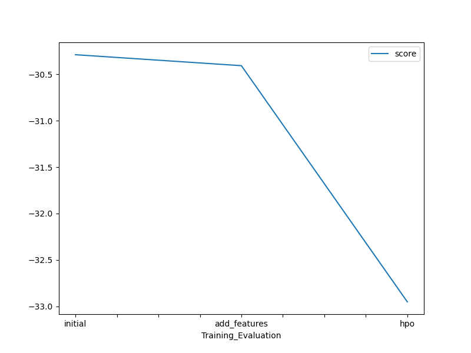
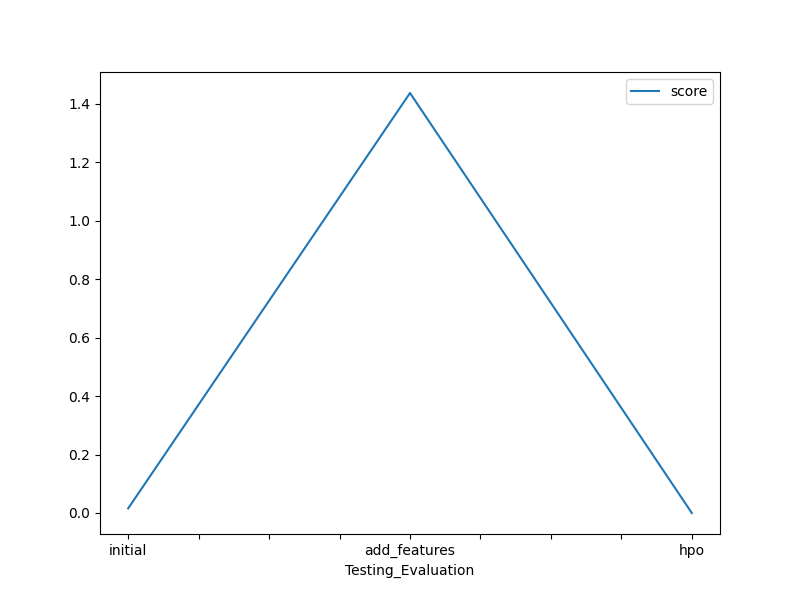
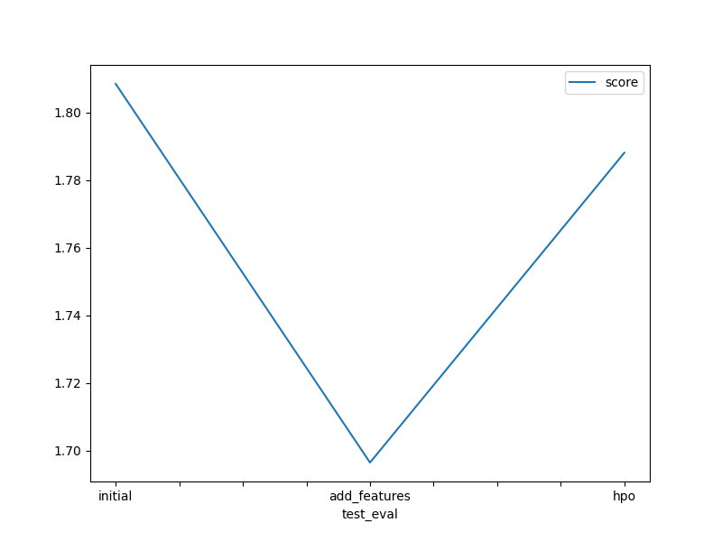

## Predict Bike Sharing Demand with AutoGluon

### Overview

In this project, I tackle the challenge of predicting bike sharing demand using the AutoGluon library. Leveraging the skills and knowledge gained from the Introduction to Machine Learning course, 
I dive into a Kaggle competition with the aim of building a robust predictive model.

My workflow involved several steps
- First, I download the Bike Sharing Demand dataset from Kaggle and train a baseline model using AutoGluon.
- I then submit our initial results to Kaggle for ranking.
- Next, I iterate on the model by enhancing the dataset with additional features and tuning hyperparameters using AutoGluon.
- After each iteration, I submit the updated predictions to Kaggle to assess my progress and compete for a higher ranking.
- Finally, I consolidate the findings and insights into a report, detailing the strategies employed, the impact of feature engineering and hyperparameter tuning, and recommendations for further improvement.

### Dependencies

Python 3.7
MXNet 1.8
Pandas >= 1.2.4
AutoGluon 0.2.0 

### Installation

For this project, I used AWS Sagemaker Studio

### Project Instructions followed
 - Create an account with Kaggle.
 - Download the Kaggle dataset using the kaggle python library.
 - Train a model using AutoGluon’s Tabular Prediction and submit predictions to Kaggle for ranking.
 - Use Pandas to do some exploratory analysis and create a new feature, saving new versions of the train and test dataset.
 - Rerun the model and submit the new predictions for ranking.
 - Tune at least 3 different hyperparameters from AutoGluon and resubmit predictions to rank higher on Kaggle.
 - Write up a [report](/report-template.md) on how improvements (or not) were made by either creating additional features or tuning hyperparameters, and explaining rasonale why an approach is best approach to invest more time in.
